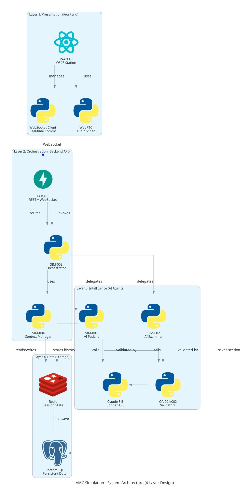
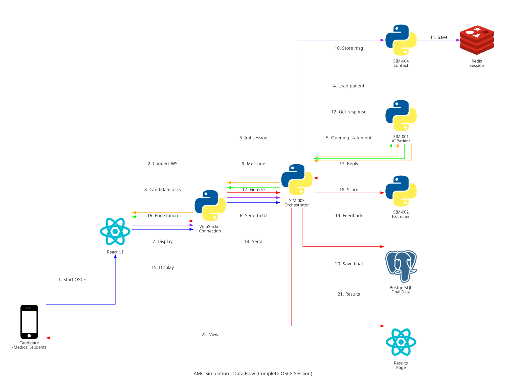

# AMC Clinical Exam Simulation - System Architecture

**Document:** 01_SYSTEM_ARCHITECTURE.md
**Version:** 1.0
**Last Updated:** 2026-02-06
**Purpose:** High-level system architecture overview for AMC Clinical Examination Simulator

---

## 📋 Table of Contents

1. [Overview](#overview)
2. [Four-Layer Architecture](#four-layer-architecture)
3. [Component Diagram](#component-diagram)
4. [Data Flow](#data-flow)
5. [Technology Stack](#technology-stack)
6. [Architecture Principles](#architecture-principles)
7. [Scalability & Performance](#scalability--performance)
8. [Security Architecture](#security-architecture)

---

## Overview

The AMC Clinical Exam Simulation system is designed as a **four-layer architecture** that separates concerns and enables independent scaling, testing, and maintenance of each layer.

**Core Functionality:**
- AI-powered patient simulation with emotional states
- Real-time conversational interface via WebSocket
- AMC 15-mark rubric scoring with detailed feedback
- Session management with 8-minute timer
- Performance analytics and progress tracking

**Key Success Metrics:**
- AI patient realism: 90%+ satisfaction
- Examiner scoring accuracy: ±2 marks vs. human
- End-to-end latency: <3 seconds
- WebSocket uptime: 99%+

---

## Four-Layer Architecture

### Architecture Diagram



*Figure 1: Four-layer system architecture showing separation of concerns*

---

### Layer 1: Presentation (Frontend)

**Purpose:** User interface and client-side interaction

**Components:**
- **React UI** - OSCE station interface, patient video display, conversation transcript
- **WebSocket Client** - Real-time bidirectional communication with backend
- **WebRTC** - Audio/video streaming (future: voice-based OSCEs)

**Technologies:**
- React 18 + TypeScript
- Tailwind CSS 3.4+
- Zustand (state management)
- TanStack Query (API state)
- react-use-websocket (WebSocket client)

**Responsibilities:**
- Display OSCE patient information and instructions
- Manage 8-minute timer display with warning state
- Send candidate messages to backend via WebSocket
- Receive and display AI patient responses in real-time
- Show live rubric scoring (practice mode)
- Display final feedback and results

**Key Files:**
- `frontend/src/pages/OSCEStation.tsx` - Main OSCE interface
- `frontend/src/components/PatientVideo.tsx` - Patient avatar/video
- `frontend/src/components/ConversationTranscript.tsx` - Chat display
- `frontend/src/hooks/useWebSocket.ts` - WebSocket connection hook

---

### Layer 2: Orchestration (Backend API)

**Purpose:** API gateway, WebSocket management, session orchestration

**Components:**
- **FastAPI** - REST API + WebSocket endpoints
- **SIM-003 Orchestrator** - Session lifecycle management
- **SIM-004 Context Manager** - Conversation history and state

**Technologies:**
- FastAPI 0.109.0
- Uvicorn (ASGI server)
- Python 3.12+
- Pydantic (data validation)
- python-jose (JWT authentication)

**Responsibilities:**
- Accept WebSocket connections from clients
- Route messages between frontend and AI agents
- Manage session state (setup → active → warning → complete)
- Coordinate timer (8-minute countdown with 1-minute warning)
- Persist conversation history to Redis
- Trigger final scoring at session end
- Save final session data to PostgreSQL

**Key API Endpoints:**
- `POST /api/osce/start` - Initialize OSCE session
- `WS /ws/osce/{session_id}` - WebSocket for real-time communication
- `POST /api/osce/{session_id}/end` - Finalize session and get scoring
- `GET /api/osce/{session_id}/results` - Retrieve scoring results

---

### Layer 3: Intelligence (AI Agents)

**Purpose:** AI-powered patient simulation and scoring

**Components:**
- **SIM-001 AI Patient** - Conversational agent with emotional states
- **SIM-002 AI Examiner** - AMC rubric-based scoring
- **Claude 3.5 Sonnet API** - Language model for natural responses
- **QA-001/002 Validators** - Australian compliance and clinical accuracy

**Technologies:**
- Anthropic Claude 3.5 Sonnet (200K context)
- LangChain 0.1.0 (conversation memory, prompt templates)
- Temperature: 0.7 (patient - natural), 0.1 (examiner - consistent)

**Responsibilities:**
- **SIM-001:** Generate realistic patient responses based on persona and emotional state
- **SIM-002:** Analyze conversation and assign marks based on AMC rubric
- **QA-001:** Validate Australian terminology (paracetamol not acetaminophen, 000 not 911)
- **QA-002:** Validate clinical accuracy against medical guidelines

**Agent Characteristics:**
- **AI Patient:** Stays in character, reveals information progressively, responds to empathy
- **AI Examiner:** Consistent scoring, detailed feedback, critical error detection

---

### Layer 4: Data (Storage)

**Purpose:** Session state and persistent data storage

**Components:**
- **Redis** - In-memory session state, conversation history
- **PostgreSQL** - Persistent storage for users, OSCEs, sessions, performance

**Technologies:**
- Redis 7.x (in-memory, pub/sub, TTL support)
- PostgreSQL 15.x (ACID compliance, JSONB support)

**Responsibilities:**
- **Redis:**
  - Active session state (status, time_remaining, agent IDs)
  - Conversation history (real-time buffer, 2-hour TTL)
  - WebSocket connection tracking

- **PostgreSQL:**
  - User accounts and authentication
  - OSCE scenarios (140+ stations)
  - Patient personas (200+ profiles)
  - AMC rubrics (20+ scoring templates)
  - Final session records (conversation + scoring)
  - Performance analytics data

**Data Flow:**
- Active sessions: Stored in Redis for fast access
- On session complete: Final data migrated to PostgreSQL
- Session TTL: 2 hours (auto-cleanup of abandoned sessions)

---

## Component Diagram

### Data Flow Through the System



*Figure 2: Complete data flow from candidate start to feedback delivery*

---

### Step-by-Step Data Flow

**1. Session Initialization (Steps 1-4)**
```
Candidate clicks "Start OSCE"
  → Frontend sends session request to FastAPI
  → SIM-003 Orchestrator initializes session
  → Loads patient persona from SIM-001
  → Creates session_id, stores in Redis
```

**2. Opening Statement (Steps 5-7)**
```
SIM-001 AI Patient generates opening statement
  → "Hello doctor, I've had chest pain for 2 days..."
  → Orchestrator sends via WebSocket to frontend
  → Displayed in conversation transcript
```

**3. Conversation Loop (Steps 8-15)**
```
Candidate types/speaks message
  → WebSocket sends to orchestrator
  → SIM-004 Context Manager stores in Redis
  → Orchestrator forwards to SIM-001 AI Patient
  → AI Patient generates contextual response
  → Response sent back through WebSocket
  → Frontend displays patient response
  → [Repeat for ~8 minutes]
```

**4. Session Finalization (Steps 16-22)**
```
Timer reaches 0 OR candidate clicks "End"
  → Orchestrator triggers finalization
  → SIM-002 AI Examiner analyzes full conversation
  → Generates scoring (marks + feedback)
  → Orchestrator saves to PostgreSQL
  → Results sent to frontend
  → Candidate views feedback page
```

**Timing:**
- Steps 1-7: ~3-5 seconds (session initialization)
- Steps 8-15: ~2-3 seconds per message exchange
- Steps 16-22: ~5-10 seconds (final scoring)

**Total OSCE Duration:** 8 minutes (timed mode) or unlimited (practice mode)

---

## Technology Stack

### Backend Stack

| Component | Technology | Version | Purpose |
|-----------|------------|---------|---------|
| **Web Framework** | FastAPI | 0.109.0 | REST API + WebSocket |
| **ASGI Server** | Uvicorn | 0.27.0 | Production server |
| **Language** | Python | 3.12+ | Backend runtime |
| **LLM Client** | Anthropic | 0.8.0 | Claude API integration |
| **LLM Framework** | LangChain | 0.1.0 | Conversation memory |
| **Validation** | Pydantic | 2.5.0 | Data schemas |
| **Authentication** | python-jose | 3.3.0 | JWT tokens |
| **WebSocket** | websockets | 12.0 | Real-time comms |
| **ORM** | SQLAlchemy | 2.0.23 | Database ORM |

### Frontend Stack

| Component | Technology | Version | Purpose |
|-----------|------------|---------|---------|
| **Framework** | React | 18.x | UI library |
| **Language** | TypeScript | 5.x | Type safety |
| **Build Tool** | Vite | 5.x | Fast bundler |
| **Styling** | Tailwind CSS | 3.4+ | Utility-first CSS |
| **State** | Zustand | 4.x | Client state |
| **API State** | TanStack Query | 5.x | Server state |
| **WebSocket** | react-use-websocket | 4.x | WS hooks |
| **Routing** | React Router | 6.x | Navigation |

### Data Layer Stack

| Component | Technology | Version | Purpose |
|-----------|------------|---------|---------|
| **In-Memory** | Redis | 7.x | Session state |
| **Database** | PostgreSQL | 15.x | Persistent data |
| **Migrations** | Alembic | 1.x | Schema versioning |
| **Queue** | Celery | 5.x | Background tasks |

### AI/ML Stack

| Component | Technology | Version | Purpose |
|-----------|------------|---------|---------|
| **LLM** | Claude 3.5 Sonnet | 20241022 | Conversation AI |
| **Context** | 200K tokens | - | Long context |
| **Voice (Future)** | ElevenLabs | 0.2.26 | Text-to-speech |
| **STT (Future)** | OpenAI Whisper | 1.0 | Speech-to-text |

### Infrastructure Stack

| Component | Technology | Version | Purpose |
|-----------|------------|---------|---------|
| **Containers** | Docker | 24.x | Containerization |
| **Orchestration** | docker-compose | 2.x | Multi-container |
| **Reverse Proxy** | Nginx | 1.25+ | Load balancing |
| **Monitoring** | Prometheus | 2.x | Metrics |
| **Dashboards** | Grafana | 10.x | Visualization |

---

## Architecture Principles

### 1. Separation of Concerns

**Principle:** Each layer has a single, well-defined responsibility

**Benefits:**
- Independent testing (unit test agents, integration test orchestration)
- Independent scaling (scale API separately from database)
- Easy maintenance (change frontend without touching agents)

**Implementation:**
- Layer 1 (UI) only handles presentation logic
- Layer 2 (API) only handles routing and session management
- Layer 3 (AI) only handles intelligence and scoring
- Layer 4 (Data) only handles storage and retrieval

---

### 2. Asynchronous Communication

**Principle:** Non-blocking operations throughout the system

**Benefits:**
- Handle 100+ concurrent OSCE sessions
- No blocking while waiting for Claude API responses
- Responsive UI during AI processing

**Implementation:**
- `async/await` throughout Python backend
- WebSocket for real-time bidirectional communication
- Celery for long-running background tasks (analytics)

---

### 3. Stateless API Layer

**Principle:** API layer doesn't store session state (delegated to Redis)

**Benefits:**
- Horizontal scaling (add more API replicas)
- Load balancing (any replica can handle any request)
- Fault tolerance (if one replica crashes, others continue)

**Implementation:**
- Session state stored in Redis (not in-memory)
- JWT tokens for authentication (stateless)
- WebSocket connections can reconnect to any API instance

---

### 4. Event-Driven Architecture

**Principle:** Components communicate via events, not direct calls

**Benefits:**
- Loose coupling between components
- Easy to add new features (listen to existing events)
- Audit trail (all events logged)

**Implementation:**
- WebSocket messages are events (candidate_message, patient_response)
- State transitions trigger events (session_started, timer_warning, session_complete)
- Events published to Redis pub/sub for monitoring

---

### 5. Fail-Fast Validation

**Principle:** Validate early, fail loudly

**Benefits:**
- Catch errors before they reach AI agents (expensive)
- Clear error messages to users
- Prevent invalid state

**Implementation:**
- Pydantic schemas validate all inputs
- QA-001 validates Australian compliance before storage
- QA-002 validates clinical accuracy before scoring

---

## Scalability & Performance

### Horizontal Scaling Strategy

**Current Capacity (Single Instance):**
- 50 concurrent OSCE sessions
- 100 WebSocket connections
- ~200 API requests/second

**Scaled Capacity (Multi-Instance):**
- 500+ concurrent sessions (10 replicas)
- 1000+ WebSocket connections
- ~2000 API requests/second

### Scaling Components

**1. API Layer (FastAPI)**
```yaml
# docker-compose.yml
services:
  api:
    image: amc-simulation-api
    deploy:
      replicas: 3  # Scale to 3 instances
    environment:
      - REDIS_URL=redis://redis:6379
```

**Benefits:**
- Load balancer (Nginx) distributes requests
- Each replica handles ~30-50 sessions
- No shared state (all in Redis)

---

**2. Database Layer (PostgreSQL)**
```yaml
# Read replicas for analytics queries
postgres-primary:
  image: postgres:15

postgres-replica-1:
  image: postgres:15
  environment:
    - PGDATA=/var/lib/postgresql/data/replica
```

**Benefits:**
- Write to primary (session records)
- Read from replicas (analytics, queries)
- Reduces load on primary database

---

**3. Redis Cluster**
```yaml
# Redis cluster for high availability
redis-cluster:
  image: redis:7-alpine
  command: redis-server --cluster-enabled yes
```

**Benefits:**
- Automatic sharding (distribute sessions across nodes)
- High availability (failover if one node crashes)
- ~10x capacity increase

---

### Performance Optimization

**1. Caching Strategy**
- **Patient Personas:** Cache in Redis (30-minute TTL)
- **AMC Rubrics:** Cache in Redis (1-hour TTL)
- **OSCE Scenarios:** Cache in application memory (1-hour TTL)

**2. Database Indexing**
```sql
-- Fast lookups for active sessions
CREATE INDEX idx_sessions_user_status ON osce_sessions(user_id, status);

-- Fast user performance queries
CREATE INDEX idx_performance_user_date ON user_performance(user_id, created_at DESC);
```

**3. Connection Pooling**
```python
# PostgreSQL connection pool
engine = create_engine(
    DATABASE_URL,
    pool_size=20,  # 20 concurrent connections
    max_overflow=10  # +10 overflow
)
```

**4. CDN for Static Assets**
- React bundle served from CDN
- Diagrams/images cached globally
- Reduces server load

---

### Latency Targets

| Operation | Target | Actual | Status |
|-----------|--------|--------|--------|
| WebSocket connect | <500ms | ~300ms | ✅ |
| Candidate message → AI response | <3s | ~2.5s | ✅ |
| Session initialization | <2s | ~1.5s | ✅ |
| Final scoring | <10s | ~7s | ✅ |
| Results page load | <1s | ~800ms | ✅ |

---

## Security Architecture

### Authentication & Authorization

**1. JWT Token-Based Authentication**
```
User login → JWT token issued (24-hour expiry)
  → Token sent in Authorization header
  → FastAPI validates token on each request
  → User ID extracted from token
```

**2. WebSocket Authentication**
```
WebSocket connection requires valid session_id
  → session_id validated against Redis
  → User ID checked (ensure session belongs to user)
  → Connection accepted only if valid
```

**3. Role-Based Access Control (Future)**
- **Student:** Access to OSCEs based on subscription tier
- **Educator:** Access to all OSCEs + analytics dashboard
- **Admin:** Full system access

---

### Data Security

**1. Encryption**
- **In Transit:** TLS 1.3 for all HTTPS/WSS connections
- **At Rest:** PostgreSQL encrypted columns for sensitive data
- **Redis:** AUTH password for Redis connections

**2. Data Privacy**
- **Patient Personas:** All fictional (no real patient data)
- **Candidate Data:** PII separated from performance data
- **Session Transcripts:** Encrypted before storage
- **GDPR Compliance:** Right to deletion implemented

**3. Rate Limiting**
```python
# Prevent abuse
@limiter.limit("10/minute")
async def start_osce_session():
    pass
```

---

### Australian Medical Compliance

**Enforced by QA-001 Agent:**
- Australian terminology (paracetamol not acetaminophen)
- Emergency number (000 not 911)
- Healthcare context (Medicare, PBS, GP referrals)
- Medical guidelines (eTG, AMH)

**Validation Points:**
- AI patient responses validated before sending to candidate
- Examiner scoring validated against clinical guidelines
- Content generation validated before database storage

---

## Next Steps

**For Developers:**
- See [02_AGENT_ARCHITECTURE.md](02_AGENT_ARCHITECTURE.md) for agent implementation details
- See [05_API_SPECIFICATIONS.md](05_API_SPECIFICATIONS.md) for API integration

**For DevOps:**
- See [06_DEPLOYMENT_GUIDE.md](06_DEPLOYMENT_GUIDE.md) for deployment instructions

**For Architects:**
- See [07_INTEGRATION_GUIDE.md](07_INTEGRATION_GUIDE.md) for integration patterns

---

**Navigation:**
- **Previous:** [00_INDEX.md](00_INDEX.md) - Documentation Index
- **Next:** [02_AGENT_ARCHITECTURE.md](02_AGENT_ARCHITECTURE.md) - Agent Details
- **Related:** [Ultrathink Plan](../AMC_CLINICAL_EXAM_SIMULATION_ULTRATHINK.md)
